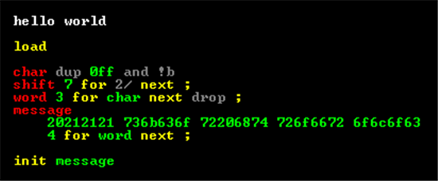
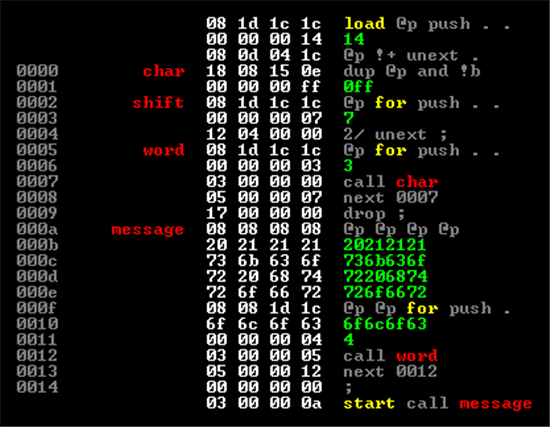
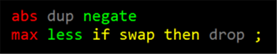
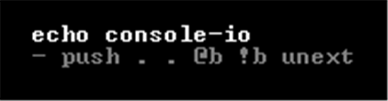
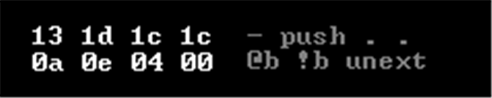
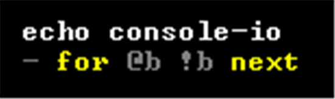
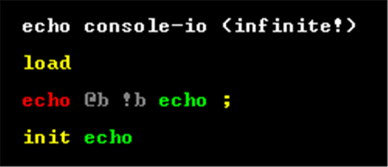
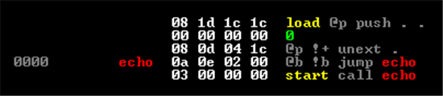
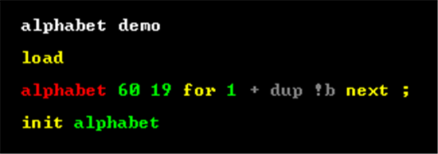
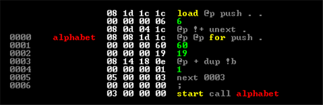

# The Beautiful Simplicity of colorForth

This is the third in a series:

* [Chuck Moore's Creations](chuck_moores_creations.md)
* [Programming the F18](programming_the_f18.md)
* Beautiful Simplicity of colorForth
* [Multiply-step Instruction](multiply_step.md)
* [Simple Variables](simple_variables.md)

As much fun as hand packing instructions was in [the last post](programming_the_f18.md), that was _tedious_. Let's move on to colorForth.



Don't worry too much about what the code above does (prints "colorForth rocks!"). It compiles to this:



Isn't the source beautiful? So colorful! The colors are not merely syntax highlighting. They drive the semantics! They are chosen at author-time in a specialized editor. I'm [working on a little tool chain](http://github.com/AshleyF/Color) including such an editor, an assembler and hardware emulator. [Here's a demo](http://youtu.be/LJoRyxRcj4A)

There are white comments, yellow macros, red definitions with gray instructions and green literal numbers and calls to previously defined (red) words. You can get a basic idea of the structure of the language. Reading top to bottom, you have definitions from low to high level in terms of primitives, literals and calls to previously defined words (never forward references).

In general, the idea is to provide higher and higher levels of abstraction without ever hiding the levels below. [All abstractions are leaky!](http://www.joelonsoftware.com/articles/LeakyAbstractions.html) You should be able to take full advantage of the hardware in minute detail and at the same time work at higher levels of abstraction when you so choose. The assembler should not be "magic." It should be very simple, straight forward and easy to reason about exactly what your code is turning into on the chip. That is the colorForth way.

| Color  | Time    | Purpose                                             |
|--------|---------|-----------------------------------------------------|
| White  | Ignored | Comment (ignored by assembler)                      |
| Gray   | Compile | Literal Instruction (packed by assembler)           |
| Red    | Compile | Add name/address pair to dictionary.                |
| Yellow | number  | Compile Immediately push number (assembly-time)     |
| Yellow | word    | Compile Immediately call (i.e. assembly-time macro) |
| Green  | number  | Execute Compile literal (pack @p and value)         |
| Green  | word    | Execute Compile call/jump (to defined red word)     |
| Blue   | Display | Format word (editor display-time)                   |

## Forth Programmer's Perspective

If you're used to "regular" Forth then you probably think of the colors as merely saving syntax. There is more to it than that. Indeed though, a white `foo` is the same as `( foo )` or `\ foo`. A red `bar` is equivalent to `: bar` or `create bar`. A yellow `baz` is like `[ baz ]`. But there's more...

As a Forth programmer, maybe you noticed that the `char` word above is missing a simicolon! It "falls through" to `shift`. Here's another example:



There's no return (`;`) between them. You can have multiple entry points and exit points in definitions! There is a certain simplicity and power that comes from not having a compiling vs. immediate mode as in regular Forth. Immediate words are just yellow and can be anywhere. Red words can also be _anywhere_. They simply give names to the current address in the instruction stream. There is no colon (`:`) word and definitions don't necessarily end with a return (`;`). It's also common to have an early return rather than an `else`. It's a different way to program, even for a Forth.

Another difference to regular Forth is pervasive use of recursion. There is no "smudge" bit. Names (red) are available immediately for use as green calls within their own definitions. Using recursion is very common in colorForth; replacing many of classic Forth's looping constructs. I've blogged some years ago about how recursion is the new iteration. You need not worry about blowing the return stack because of tail call optimization. A green call preceding a return is optimized to a jump. Simple as that!

> ### Note for Color Coders
 
> If you are already a colorForth programmer then you may have noticed a couple of strange and missing things in my description so far. I use gray words to represent instruction literals. That is, these words _render_ as mnemonics in the editor but they _serialize_ as literal instruction op codes. This makes the format compact and the job of the assembler a bit easier. This is an idea that Jeff Fox used in his [Aha](http://www.ultratechnology.com/ahatalk.htm) system and Chuck Moore uses in his [etherForth](http://www.colorforth.com/ef.htm). Also, I don't have magenta variables as in GreenArray's arrayForth and I don't have a separate macro dictionary and so no cyan words.
 
> I could elaborate on why, but basically some of these features aren't a good fit for a Forth hosted on the chip itself with source coming from flash (e.g. no magenta words). A separate macro dictionary with green words "magically" becoming immediate is interesting but adds complexity. It is more fragile to expect the author to know which words do compilation (and so should be yellow) and which are meant to be called at run-time. Notice that `if`, `then`, `for`, `next`, etc. are yellow in the examples given. Another interesting thing that arrayForth does is upon a yellow to green transition, a literal is compiled. I don't like this complexity or "magic" either (and it requires a macro dictionary) so I have a simple yellow `lit` word for this.

## Editor Perspective

It may help to understand how the editor represents code to be serialized for consumption by the assembler/compiler. Tokens in source become a list of `Tagged` values:

``` fsharp
type Kind =
    | Number of int
    | Word __of string

type Tagged =
    | Define      of string
    | Execute     of Kind
    | Compile     of Kind
    | Comment     of string
    | Format      of string
    | Instruction of byte
```

The editor is not a plain text editor. You are authoring a list of these tagged tokens. Tokens may be numbers (hex) or may be strings. There is no syntax within a string token. Anything goes!

These are rendered in various colors but could just as easily be represented some other way (if you're color blind for example). The key is that there is no surrounding syntax and even the content of individual tokens doesn't determine their purpose. It's the tagging chosen by the author. You can see that we have definition names (red), comments (white), format words (blue) and literal instructions (gray), and that other numbers and words may be executed immediately (yellow) or compiled to be executed at run-time (green).

While authoring source, you actively choose the colors as you go. There is no color distinction between numbers and words (though there clearly is a distinction in the AST). This too could be chosen by the author; allowing, for example, the token `ff` to be treated as a hex number or as a word name. That would be edit-time functionality. I chose to actually require that numbers be indicated by a leading digit. Notice the `0ff` in the first example.  I guess you could consider this one small bit of "syntax", but really it's just a indicating the `Kind` at edit-time. In the serialized source and at compile-time this is known by the `Tagged Kind`.

## Compiler Perspective

The compiler is extremely simple. In Chuck Moore's talk at Strange Loop he said that "It's arguable whether it should be called a compiler or an assembler, but compiler is a more impressive word." Author-time tagging not only leads to a compact, syntax-less language. It also leads to many compile-time decisions already having been made by the author. Compilation is a very straight forward, single pass process. The ultimate result of compilation is an instruction stream be executed by the F18 and/or packed in memory. During the process, a dictionary of addresses (named by red words) is also generated.

A few pieces of state are maintained during assembly: a pointer to the current address and slot to which we're compiling and to the next address (not necessarily adjacent if literals have been slipped inline). Also, as we said, there's the a dictionary of name to address mappings built up as we go. Assembly-time macros may make use of the stack as well; usually storing addresses to be picked up by other macros as back references or as forward references needing to be "patched." We'll get into assembler macros in a future post.

At compile-time, white comments and blue format words are ignored. That's easy enough!

Gray words are serializes as literal op code values. This means that all the assembler needs to do is pack them in the current slot and advance some pointers. The first example from the [last post](programming_the_f18.md):

| Source                   | Assembly                              |
|--------------------------|---------------------------------------|
|  |  |

Yellow tokens are executed immediately during compilation. A yellow number is pushed to the compile-time stack. Yellow words are looked up in the dictionary (a previous red definition) and an immediate call is made to this address. Presumably the definition is a macro doing useful compile-time work. For example, in the echo example above, packing the `push` and nops (`.`) setting up the for loop and the decision to use a micronext (`unext`) can be automated with yellow `for`/`next` words:

| Source                        | Assembly                                  |
|-------------------------------|-------------------------------------------|
|  |  |

Red words don't emit any code. They just add an entry to the dictionary; mapping the name to the current address to which we're compiling code.

Green tokens are compiled to be executed later at run-time. A green _number_ compiles to code to fetch a literal value to the stack at run-time. That is, an `@p` instruction and a value slipped inline in the next instruction cell (see the [previous post](programming_the_f18.md) if this doesn't make sense!). A green _word_ is looked up in the dictionary (again, a previous red definition) and compiles to a call to this address. There is an optimization for tail calls in which a green word followed directly by a return becomes a jump instead of a call. There is no sense in calling something just to return and immediately return again. This saves return stack space and means that you can have infinite recursion! By the way, this optimization is done by the yellow return (`;`) macro. This is why we generally avoid the plain gray `;` word.

The second sample from [last post](programming_the_f18.md) looks much better written in colorForth:

| Source                                   | Assembly                                     |
|------------------------------------------|----------------------------------------------|
|  |  |

The alphabet sample from [last post](programming_the_f18.md) is pretty in colorForth too:

| Source                           | Assembly                                      |
|----------------------------------|-----------------------------------------------|
|  |  |

This is really all that the compiler does! It's an absolutely simple and completely straight forward top to bottom process. There's no magic. Any crazy optimizations are done by you. Macros can do more complicated things but these are written by you (or at least the source is available). They are just words like any other. Working with such a direct and simple system is a joy!

## Next: [Multiply-step Instruction](multiply_step.md)
