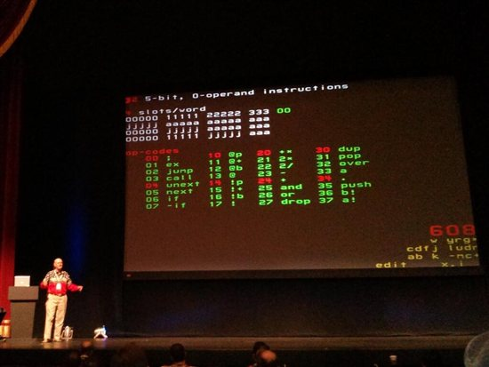
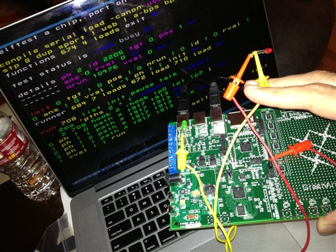

# Chuck Moore's Creations

This is the beginning of a series:

* Chuck Moore's Creations
* [Programming the F18](programming_the_f18.md)
* [Beautiful Simplicity of colorForth](beautiful_simplicity.md)
* [Multiply-step Instruction](multiply_step.md)
* [Simple Variables](simple_variables.md)

When I heard that [Chuck Moore was speaking at Strange Loop](https://thestrangeloop.com/sessions/programming-a-144-computer-chip-to-minimize-power) this year I just had to go. His talk yesterday was excellent! I'm not going to summarize it here. The talk will be online soon enough. Here I just want to make a few observations about his contribution and begin a series exploring the F18 and GA144 architecture.

**[19 DEC 2013 Update: His talk is up. [Go watch it!](http://www.infoq.com/presentations/power-144-chip)]**

His career has been amazing. He invented Forth in 1968, then went on to invent stack machine hardware in the mid-80s while relentlessly improving both for the past 45 years. His singular focus has resulted in highly perfected software and hardware, perfectly suited to one another. His latest creation (and the subject of his presentation) is a 144-core, ultra low-power chip sold by [GreenArrays](http://www.greenarraychips.com/) programmed in Forth (colorForth, polyForth, ...).



I got a chance to shake his hand and ask him about his plans for [etherForth](http://www.colorforth.com/ef.htm). Sadly, he said that it's essentially his personal project and he doesn't want to support it. GreenArrays has wonderful, well-supported tooling (running on a PC), but I wanted to play with a complete system hosted on the chip itself, and I wanted to see his code to study. He has [blogged about bits and pieces of it](http://www.colorforth.com/etherCode.htm), but I wanted to see the editor and compiler and complete video driver. Oh well, I'll have have fun trying to do it myself! Won't be freaking easy though...



I first got a chance to use the GreenArrays GA144 a year or so ago. It's a wonderful chip! I think of it as essentially 144 tiny Forth inner interpreters in hardware. The easiest way to get started is to buy the [eval board from GreenArrays](http://www.greenarraychips.com/home/products/index.html). The arrayForth environment is quite unconventional and mind bending, but so much fun to learn and the documentation is excellent. If you can't afford the ($450) eval board (worth every penny), then you can [cobble together a minimal setup for about $60](http://www.greenarraychips.com/home/documents/budget.html). Or for the bargain price of $0, you can follow this series of blog posts and at least get to play with a software simulation I'll be putting together. It's quite a challenge to learn and you have to be willing to wrap your head around a lot of unconventional choices; suspend disbelief and eventually realize the beauty of colorForth and the hardware architecture. It's a mind blowing, fun journey.

Honestly, my journey was to first use the eval board for something at work and under deadline pressure. It was frustrating, slow going and we ended up using some standard MCU instead. Later I came back to it as a hobby project and with the attitude that I should just take my time and work through it bit by bit. Chuck Moore is absolutely brilliant and he has poured his immense intelligence into this one, relatively small focus for longer than I've been alive! There isn't much written about his work. The only way to appreciate it is to dig in and look at the colorForth source and his hardware designs. I decided that I should try to wrap my head around his point of view as much as possible and forget whatever conventions and preconceptions I have. It's been great fun and still going!

## Nothing Conventional

In his talk, Chuck Moore was wearing his FiveFinger shoes on stage. That cracked me up. Absolutely no convention is followed blindly by this guy. He says casually during his talk, "I use 6-bit bytes, so..." No conventional 8-bit bytes for him. It does make more sense given the 18-bit words on the F18, but again, who doesn't go with power-of-two-sized words? Other aspects of his design are so out there: the F18 is completely asynchronous (no clock) and literally does nothing while blocking on a port read/write. It allows executing instructions streaming in over a port directly (without loading into memory). Multiple instructions are packed in each word allowing fewer fetches and interesting things like micronext (unext) which creates tiny (3 instruction at most) loops with _zero_ fetches. The list goes on...

Even within the Forth community he's an outlier. His colorForth is hardly recognizable to someone familiar with ANS Forth. I'll do another post on colorForth but some of the beautiful strangeness, aside from the obvious tagged words (colors), includes allowing multiple entry and exit points in a definition and allowing definitions to "fall through" to each other. It's common to return early within an `if`/`then` rather than using else. Also using recursion (no "smudge" bit) as a primary looping construct (deprecating `do`/`loop`, `begin`/`until`, etc. and using `for`/`next` less often). The `if` word leaves the predicate on the stack, meaning that you `drop` it manually when necessary but never have to `dup` to preserve. The effortless (and syntaxless) switching between green (compiled) and yellow (immediate) words encourages moving as much as possible to compile-time. The idioms are completely different to regular Forth.

He is endlessly willing to rethink things from a truly clean slate. It's astonishing how simple things become when you're willing to do that and design something bottom up with that perspective; the "bottom" being raw silicon. He said in his talk that the colorForth compiler is "a dozen or so lines of code." This is shocking to most people. It's because tokenization is done at edit-time and there is almost a one-to-one correspondence between the primitive words in the language and instructions on the chip. The compiler is left with not much to do other than maintain the dictionary and do very straightforward instruction and `call`/`jump` packing. This "brutal simplicity" is possible because every aspect has been rethought and carefully orchestrated to work perfectly together. Every convention is open to change.

## The F18 Architecture

The GA144 is an array of 144 tiny computers. Each computer is an instance of the [F18 architecture](http://www.greenarraychips.com/home/documents/greg/PB003-110412-F18A.pdf). Each can be thought of as a Forth inner interpreter in hardware. Separate data and return stacks, zero-operand instructions working with values on the stacks. Most of the instructions have a very direct mapping to common Forth idioms and words (e.g. next/unext loops with induction counter).

As always, there are some very strange aspects of the architecture: 18-bit words, 5-bit instructions packed four per word with the last (3-bit) slot having assumed trailing zeros; meaning only a particular subset of eight instructions can go in this slot. Destination address length depends on the slots used and replace the low bits in the program counter; essentially forming "pages" within which you can jump. Extended arithmetic bit on the program counter changing the "mode" of execution; going to the return stack allowing nested mode switches. An asynchronous ALU that needs time to settle; necessitating nop instructions before certain operations. The stacks are circular. The list goes on...

There are just 32 instructions. You can see them listed on the slide shown during the talk above. He said something like, "If you haven't already, then just take another five minutes and you'll have them memorized." It is a simple machine. The best way to learn the instruction set is to just [read the doc](http://www.greenarraychips.com/home/documents/greg/DB001-110412-F18A.pdf). It's a nice concise doc (as are all the GreenArrays docs). You can also go through the "F18A Architecture and Instruction Set" portion of the [arrayForth Institute course](http://school.arrayforth.com/index.php?category=5#categoryContent). It's free and can be done in an afternoon.

I don't think I've ever made a blog post without code and it looks like I'm about to. So okay, here's some code; an F18A simulator in F# (https://github.com/AshleyF/Color). I want to start off by playing with just the instruction set. I think that some of the weirdness and constraints of the actual hardware distracts from learning just what can be done with the instruction set. The below is essentially an F18A, but with a large amount of RAM (8K words rather than 64), no ROM, byte-sized slots (regular 8-bit bytes I mean!) in 32-bit words without a truncated last slot, and a simple I/O scheme making it easy to interface with the console and file system.

We'll make use of this in future posts once we build an editor and assembler. Feel free to hand-poke bytes for now! :)

``` fsharp
module Machine

type Machine (input: (unit -> int) array, output: (int -> unit) array) =
    let high = 0x8000
    let mutable p, i, slot, t, s, si, r, ri, a, b = high, 0, 4, 0, 0, 0, 0, 0, 0, high

    let stk, rtn = Array.zeroCreate 8, Array.zeroCreate 8
    let move x d = (x + d) &&& 0b111
    let pushr v = rtn.[ri] <- r; ri <- move ri 1; r <- v
    let popr () = ri <- move ri - 1; let x = r in r <- rtn.[ri]; x
    let pushs v = stk.[si] <- s; si <- move si 1; s <- t; t <- v
    let pops () = let x = t in t <- s; si <- move si - 1; s <- stk.[si]; x

    let ram = Array.zeroCreate 8192
    let mem x = x &&& high <> high
    let get x = if mem x then ram.[x] else input.[x ^^^ high] ()
    let set x v = if mem x then ram.[x] <- v else output.[x ^^^ high] (v)
    let fetchm x = get x |> int |> pushs
    let storem x = pops () |> set x

    let unary f = t <- f t
    let binary f = t <- pops () |> ft
    let flip f a b = f b a
    let incp () = let p' = p in (if mem p then p <- p + 1); p'
    let inca () = let a' = a in (if mem a then a <- a + 1); a'

    let step () =
        let fetch () = i <- incp () |> get; slot <- 0
        let decode () = slot <- slot + 1; (i >>> (32 - slot * 8)) &&& 0xff
        let slotzero () = slot <- 0
        let setp x = p <- x; slotzero (); fetch ()
        let jump () = let m = (0xffffff >>> (slot - 1) *8) in (p &&& (~~~m)) ||| (i &&& m) |> setp
        if slot = 4 then fetch ()
        let ex () = let x = r in r <- p; setp x
        let next f g = if r = 0 then popr () |> ignore; f () else r <- r - 1; g ()
        let multiply () =
            if (a &&& 1) = 1 then t <- t + s
            let x = t &&& 1 in t <- t >>> 1; a <- ((uint32 a) >>> 1) ||| ((uint32 x) <<< 31) |> int
        let cond f = if f t then jump () else fetch ()
        match decode () with
            | 0x00 -> p <- popr (); fetch () // ; (return)
            | 0x01 -> ex ()                  // ex (execute)
            | 0x02 -> jump ()                // name ; (jump)
            | 0x03 -> pushr p; jump ()       // name (call)
            | 0x04 -> next id slotzero       // unext (micronext)
            | 0x05 -> next fetch jump        // next
            | 0x06 -> cond ((=) 0)           // if
            | 0x07 -> cond ((<=) 0)          // -if (minus-if)
            | 0x08 -> incp () |> fetchm      // @p (fetch-P)
            | 0x09 -> inca () |> fetchm      // @+ (fetch-plus)
            | 0x0a -> fetchm b               // @b (fetch-B)
            | 0x0b -> fetchm a               // @ (fetch)
            | 0x0c -> incp () |> storem      // !p (store-P)
            | 0x0d -> inca () |> storem      // !+ (store-plus)
            | 0x0e -> storem b               // !b (store-B)
            | 0x0f -> storem a               // ! (store)
            | 0x10 -> multiply ()            // +* (multiply-step)
            | 0x11 -> unary (flip (<<<) 1)   // 2* (two-star)
            | 0x12 -> unary (flip (>>>) 1)   // 2/ (two-slash)
            | 0x13 -> unary (~~~)            // - (not)
            | 0x14 -> binary (+)             // + (plus)
            | 0x15 -> binary (&&&)           // and
            | 0x16 -> binary (^^^)           // or (exclusive or)
            | 0x17 -> pops () |> ignore      // drop
            | 0x18 -> pushs t                // dup
            | 0x19 -> popr () |> pushs       // pop
            | 0x1a -> pushs s                // over
            | 0x1b -> pushs a                // a
            | 0x1c -> ()                     // . (nop)
            | 0x1d -> pops () |> pushr       // push
            | 0x1e -> b <- pops ()           // b! (B-store)
            | 0x1f -> a <- pops ()           // a! (A-store)

    member x.Run() = try while true do step () with _ -> ()
```

The I/O scheme is a pair of `int -> unit` and `unit -> int` functions. Arrays of these are passed to the Machine constructor. The fetch and store instructions with an address (in `A`, `B` or `P`) having the high bit set become indexes into this array of I/O functions (see `get` and `set` above). Here are some for console and disk access. Notice that you can set the cursor position and console colors (useful for displaying colorForth source eventually, BTW!) via a simple protocol. The file system is similar to standard Forth in which numbered blocks are read and written. An input, output and "block select" port are given.

``` fsharp
let consoleInput () = Console.ReadKey(true).Key |> int
 
let consoleOutput x =
    match x >>> 24 with
    | 0 -> char x |> Console.Write
    | 1 -> Console.SetCursorPosition(x &&& 0xff, (x >>> 8) &&& 0xff)
    | 2 -> Console.ForegroundColor <- enum (x &&& 0xf)
    | 3 -> Console.BackgroundColor <- enum (x &&& 0xf)

let blockIO =
    let block b = File.Open(sprintf @"..\..\..\ColorSource\%i.blk" b, FileMode.OpenOrCreate, FileAccess.ReadWrite, FileShare.Read)
    let file = block 0
    let reader = ref (new BinaryReader(file))
    let writer = ref (new BinaryWriter(file))
    let select i =
        (!reader).Close(); (!writer).Close()
        let file = block i
        reader := new BinaryReader(file)
        writer := new BinaryWriter(file)
    let input () = (!reader).ReadInt32()
    let output (v : int32) = (!writer).Write(bytes); (!writer).Flush()
    select, input, output

let blockSelect, blockInput, blockOutput = blockIO
```

Finally, a machine is constructed with I/O devices.

``` fsharp
let machine = new Machine([|blockInput; consoleInput|], [|consoleOutput; blockSelect; blockOutput|])
machine.Run()

Console.ReadLine() |> ignore
```

Notice that in the `Machine` above, the `P` and `B` registers are initialized to the first I/O ports (while `A` is zero). This means that the first thing it does when run is read instructions from the first input port (the `0.blk` file), so this is where boot code should be. Also, `B` is commonly used for output and is conveniently initialized to `consoleOutput`.

## Next: [Programming the F18](programming_the_f18.md)
