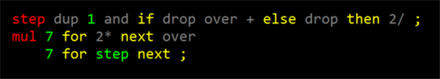
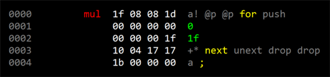

# Multiply-step Instruction

This is the forth in a series:

* [Chuck Moore's Creations](chuck_moores_creations.md)
* [Programming the F18](programming_the_f18.md)
* [Beautiful Simplicity of colorForth](beautiful_simplicity.md)
* Multiply-step Instruction
* [Simple Variables](simple_variables.md)

Here's a bit-twiddly interview question for you: Design an algorithm to multiply fixnum integers in O(log n) time using only addition. This may come in handy given that [the F18](http://www.greenarraychips.com/home/documents/greg/DB001-110412-F18A.pdf) doesn't have a plain multiply instruction!

Starting with the primary school algorithm, but in binary:

           110001
         × 111101
         --------
           110001
          0000000
         11000100
        110001000
       1100010000
    + 11000100000
    -------------
     101110101101  <-  'bad' in hex :)

Summing the product of each digit of the multiplier (right to left) and the multiplicand; shifting (padding with zeros) as we go. Of course, single binary digit multiplication is super-easy; being just zero or the multiplicand itself.

Another way to formulate this is:

      1 × 110001 << 0 =      110001
      0 × 110001 << 1 =     0000000
      1 × 110001 << 2 =    11000100
      1 × 110001 << 3 =   110001000
      1 × 110001 << 4 =  1100010000
    + 1 × 110001 << 5 = 11000100000

Or we can begin with the multiplicand shifted to the left and shift right after each step:

      1 × 11000100000 >> 5 =      110001
      0 × 11000100000 >> 4 =     0000000
      1 × 11000100000 >> 3 =    11000100
      1 × 11000100000 >> 2 =   110001000
      1 × 11000100000 >> 1 =  1100010000
    + 1 × 11000100000 >> 0 = 11000100000

This leads to realizing that In fact we can do it in place. We can begin with the multiplier in the right-most bits, processing one bit at a time, shifting right after conditionally adding the left-shifted multiplicand. Pretty slick!ext we'll see how to make simple variables >

This code works with a pair of 8-bit values; first preparing by shifting the multiplicand 8 bits to the left, then performing 8 `step` operations. Each `step` adds the multiplier if the low bit is set, then (always) shifts everything right. There you have it; multiplication in terms of only addition and shifting!

    0000000000111101    Left initially zero, right multiplier.

    0011000100111101    Add multiplicand (left - 110001).
    0001100010011110    Then shift right.

    0001100010011110    Don't add (zero bit).
    0000110001001111    Shift right.

    0011110101001111    Add multiplicand (one bit)
    0001111010100111    Shift right.

    0100111110100111    Add multiplicand.
    0010011111010011    Shift right.

    0101100011010011    Add multiplicand.
    0010110001101001    Shift right.

    0101110101101001    Add multiplicand.
    0010111010110100    Shift right.

    0010111010110100    Don't add (zero bit).
    0001011101011010    Shift right.

    0001011101011010    Don't add (zero bit).
    0000101110101101    Shift right. And we're done!

## The Multiply-step Instruction

This is essentially how the F18 works. There is a multiply-step (`+*`) instruction that carries out one step of this process; applied n-times (usually in a micronext loop) to perform an n-bit multiply. You can read the [details in the doc](http://www.greenarraychips.com/home/documents/greg/DB001-110412-F18A.pdf). The multiplier is placed in `A`, the multiplicand in `S` and an initial zero in `T`. Together, `T` and `A` are treated as a single shift register (like the left/right in our example above). Then a series of multiply-step (`+*`) instructions are executed; leaving the result (in `A`). Here's Greg Bailey's excellent description from the GreenArrays [arrayForth Institute course](http://school.arrayforth.com/): http://youtu.be/RFN_SJ4Qw1Q

As he says, there are other purposes for the `+*` instruction. We'll get into them later.

## Examples

Here's an example (note that the sim we're using is 32- rather than 18-bit, thus the `1f` loop count)

It may be more efficient to unroll the loop:

Or a good balance might be to do sets of three `+*` in a micronext loop:

Try is out with some silly hex words:

## Next: [Simple Variables](simple_variables.md)
