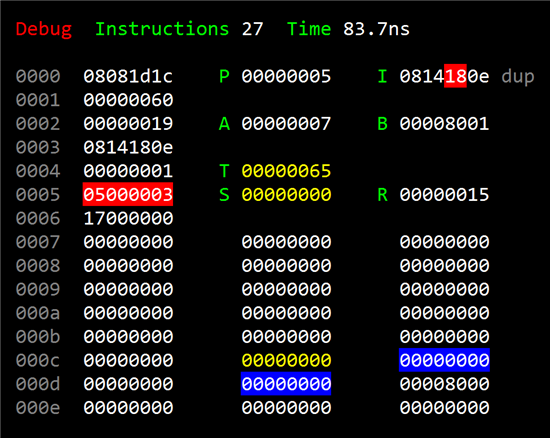

# Programming the F18

This is the second in a series:

* [Chuck Moore's Creations](chuck_moores_creations.md)
* Programming the F18
* [Beautiful Simplicity of colorForth](beautiful_simplicity.md)
* [Multiply-step Instruction](multiply_step.md)
* [Simple Variables](simple_variables.md)

As we saw in the last post, the GA144 chip is an array of 144 tiny computers or "nodes". We tend not to call them "cores" because they are really more independent than that. Programming these interconnected nodes is something like working with agents or CSP. Each is an instance of the F18 architecture and can be thought of as a Forth inner interpreter in hardware. Pretty neat! Probably you're used to stack machines in the form of VMs (e.g. the JVM and CLR). It's indeed a very simple and beautiful model. The GreenArrays chip brings this beauty to life in silicon!

In this post we'll learn the basics of the F18 architecture and the instruction set. We'll write a few simple programs in raw machine code just to get a feel for it. In later posts we'll move on to using colorForth to program it.

## Architecture

Before we can program an array of 144 nodes, we need to first learn to program one. I've been having a lot of fun playing around with the simulator from last post. There's the sim, a debugger, colorForth editor and assembler all [up on GitHub](http://github.com/AshleyF/Color) if you want to play along. Here is the debug view:

You can see pretty much _all_ of the guts of the computer; a handful of registers, a couple of stacks and some memory. To the left is the portion of RAM from which we're executing. The right two columns show all the registers and the two stacks. It is a truly simple machine. I'm going to give just an overview here. If you want to learn the nitty gritty details I would suggest reading the [well written GreenArrays docs](http://www.greenarraychips.com/home/documents/greg/DB001-110412-F18A.pdf) and maybe taking the free ['F18A Architecture and Instruction Set' portion of the arrayForth Institute course](http://school.arrayforth.com/index.php?category=5#categoryContent).

## Instruction Fetching

The `P` register is the program counter; pointing at the next instruction cell to be fetched. I'll call these "cells" so as not to confuse with Forth "words". Initially `P` points at a port reading instructions from a block on disk (block 0, to which the assembler targets). When pointing at a port like this, it continues to do so until a `(call)`, `(jump)`, etc. directs it to fetch instructions from other ports or from RAM. However, when fetching from RAM, `P` will auto-increment. The most recently fetched instruction cell is placed in register I where it is executed slot by slot - four slots containing op codes (see below). It's important to realize that we don't execute through `P`. Instead we first fetch through `P` into `I` and then execute instruction slots from `I`. Instructions may in the mean time further advance `P` (e.g. `@p` to fetch a literal value inline) without immediately affecting execution. There may even be a micronext `(unext)` loop within `I` without further fetching at all. Very interesting processor this is!

## General/Address Registers

The `A` register is a general purpose register. It may be used to store data or addresses. Those addresses may be into RAM or to/from a port. The `B` register is write-only and is used only for addressing.

Having separate address registers may be a very strange thing to someone familiar with Forth. Normally, addresses go on the stack and the fetch (`@`) and store (`!`) operations use them from there. On the F18, fetch and store are always through `P`, `A` or `B`. Don't forget that this machine is not just a VM with nice pretty abstractions. The F18 is implemented in silicon, and physical address lines through the top of the stack along with ALU being driven by the same registers is difficult and/or inefficient (apparently - I'm not a chip designer). Just don't be confused by this. This is an example, I think, of Chuck Moore's philosophy of not making the simplest possible software or the simplest possible hardware, but instead the simplest _combination of the two._ This is a trade-off made to favor hardware simplicity; breaking software composition a bit.

## Stacks

You must read [Chuck Moore's short essay on push down stacks](http://colorforth.com/stack.htm). Each F18 node has a pair of stacks. This dual-stack approach is clearly the Forth architecture realized in hardware; a wonderful thing. Each stack is eight elements indexed circularly. Nothing moves when pushing and popping these stacks. A 3-bit pointer is incremented/decremented. The circularity comes from simple overflow of this 3-bit pointer. Being circular leads to some interesting techniques such as cycling endlessly through values and fearlessly leaving things on the stack to be stomped on later, saving cycles "cleaning up." Above each stack are registers (`R`, `T` and `S`) optimizing access to the top elements used directly by instructions. 

One is a return stack; storing addresses for returning from nested calls. Having such a lightweight calling convention is what allows for extremely aggressive factoring in Forth. Some say that C is a high level assembly language, but you cannot escape the complected calling convention there. In Forth a call costs only a push/pop of a return address and having lots of small routines is encouraged without worrying about inlining. The return stack may also be used to contain local values and hosts the induction value for (potentially nested) counted loop. The `R` register is the top of the return stack; "spilling" values to/from the eight stack elements below; effectively making this a nine-element stack. One regular register backed by eight circularly indexed ones.

The other stack is the data stack for evaluation and argument passing. Having zero-operand instructions that assume their operands are waiting near the top of the stack is what allows for very tightly packed instructions (four per cell). Also, passing arguments through the stack at call sites rather than in registers leads to simple composition of routines. That is, a sequence of calls each taking arguments and leaving return values on the stack with no explicit parameter passing between them. I've waxed rhapsodic in the past about how much I like point-free programming. This is one of the reasons I love Forth and the stack is what enables it _efficiently._ To give binary ALU operations easy access, the top two values are in the "top" (`T`) and "second" (`S`) registers. Like with `R`, these "spill" to/from the eight elements below, making a ten-element data stack.

## Instruction Set

These are the 32 instructions of this simple machine. I will briefly describe them here and will get into more detail on some (e.g. the multiply-step instruction) in future posts.

| Op | Mneumonic | Class    | Time (ns) | Notes                                                 |
|----|-----------|----------|-----------|-------------------------------------------------------|
| 00 | ;         | Transfer | 5.1       | “return”                                              |
| 01 | ex        | Transfer | 5.1       | “execute” (swap P and R)                              |
| 02 | (jump)    | Transfer | 5.1       |                                                       | 
| 03 | (call)    | Transfer | 5.1       |                                                       |
| 04 | unext     | Transfer | 2.0       | “micronext” (loop within I, decrement R)              |
| 05 | next      | Transfer | 5.1       | “next” (loop to address, decrement R)                 |
| 06 | if        | Transfer | 5.1       | (jump if T=0)                                         |
| 07 | -if       | Transfer | 5.1       | “minus-if” (jump if T≥0)                              |
| 08 | @p        | Data     | 5.1       | “fetch-p” (fetch inline literal via P, autoincrement) |
| 09 | @+        | Data     | 5.1       | “fetch-plus” (fetch via A, autoincrement)             |
| 0a | @b        | Data     | 5.1       | “fetch-b” (fetch via B)                               |
| 0b | @         | Data     | 5.1       | “fetch” (fetch via A)                                 |
| 0c | !p        | Data     | 5.1       | “store-p” (store via P, autoincrement)                |
| 0d | !+        | Data     | 5.1       | “store-plus” (store via A, autoincrement)             |
| 0e | !b        | Data     | 5.1       | “store-b” (store via B)                               |
| 0f | !         | Data     | 5.1       | “store” (store via A)                                 |
| 10 | +*        | ALU      | 1.5       | “multiply-step”                                       |
| 11 | 2*        | ALU      | 1.5       | “two-star” (left shift)                               |
| 12 | 2/        | ALU      | 1.5       | “two-slash” (right shift)                             |
| 13 | -         | ALU      | 1.5       | “not” (invert all bits)                               |
| 14 | +         | ALU      | 1.5       | “plus”                                                |
| 15 | and       | ALU      | 1.5       |                                                       |
| 16 | or        | ALU      | 1.5       | (exclusive or)                                        |
| 17 | drop      | ALU      | 1.5       |                                                       |
| 18 | dup       | ALU      | 1.5       |                                                       |
| 19 | pop       | ALU      | 1.5       |                                                       |
| 1a | over      | ALU      | 1.5       |                                                       |
| 1b | a         | ALU      | 1.5       | (A to T)                                              |
| 1c | .         | ALU      | 1.5       | “nop”                                                 |
| 1d | push      | ALU      | 1.5       | (from T to R)                                         |
| 1e | b!        | ALU      | 1.5       | “b-store” (store into B)                              |
| 1f | a!        | ALU      | 1.5       | “a-store” (store into A)                              |

In the simulator there are a couple of extra (unofficial) instructions for debugging and performance measurement:

| Op | Mneumonic | Class    | Time (ns) | Notes                        |
|----|-----------|----------|-----------|------------------------------|
| 20 | break     | Debug    | N/A       | Break into debug view        |
| 21 | mark      | Debug    | N/A       | Reset performance statistics |

The ALU operations mostly do just what you'd expect; taking one or two arguments from the stack and replacing with the result. Multiply-step is a complicated one which I'll describe in a future post. It essentially is one step in a multiply/shift operation; needing to be executed in a micronext loop to multiply values. Very primitive. You may want to generally think of the instruction set as microcode. I should point out that or is an exclusive-or and that - is a "not" operation rather than a full twos-compliment negation. We'll get into how to make good use of these instructions as we go. There are a lot of techniques to cover and it's pretty fun! The instruction set does take some getting used to.

There are the usual stack manipulation instructions `drop`, `dup` and `over`. Glaringly missing is swap. This is another place where complexity of the hardware drove the decision. We'll see how to accomplish swapping with the primitives provided and how `over` is often all you need.

The data and return stacks are "connected" in a sense. The `push` and `pop` instructions shuffle values between the tops of each. Be careful not to confuse `pop` (top of return) with `drop` (top of data). I get confused because IL has a pop instruction that that really is a _drop_.

There are instruction for fetching and storing through `P` (`@p` and `!p`), through `A` (`@`, `@+`, `!` and `!+`) and through `B` (`@b` and `!b`). Fetching through `P` (`@p`) is commonly used to fetch literal values inline from the instruction stream to the top of the stack. It is so common to index through `A` that the instruction mneumonics are simply `@` and `!` (without 'a'). Fetching and storing through `P` auto-increments (except when pointing at a port), but A may be used with or without auto-incrementation (notice the variants with/without '+'). Values may be stored into `A` (`a!`) or `B` (`b!`). Values may be retrieved from `A` (`a`) but remember that `B` is write-only.

Counted loops may be formed with `next` and `unext`. Each use `R` as the induction variable; counting down to zero. The difference between the two loop instructions is that `next` expects an arbitrary address operand, while `unext` is a loop _within_ `I`; back to the first slot. This is one of the _very_ interesting instructions; allowing looping _within_ a single fetched instruction cell. Of course these loops are _tiny_ (three instructions max) but the utility is amazing!

Conditional control transfer is done with `if` and `-if`. These branch depending on the value on top of the stack. Unlike traditional Forth "if" however, they leave the predicate value on the stack. This is convenient much of the time. Occasionally, you need to add a `drop` to discard.

Unconditional control transfer may be done with `(call)`, `(jump)` and `ex`. In particular, ex is useful for jumping to computed addresses and for doing co-routines. We'll explore this powerful feature in a future post. The `;` (return) instruction transfers out of a called or executed routine; popping an address from the return stack.

## Structure and TCO

It is _extremely_ common to break programs into many, many small routines. Aggressive factoring is a hallmark of Forth. The `(call)` and `(jump)` instructions are used to execute these routines. In fact, a high level routine may commonly be nothing but a sequence of calls followed by a return (`;`) - subroutine threading. Actually, the last call may be optimized to a `(jump)` allowing the callee to return directly to the original caller - tail call optimization is that simple!

## Encoding

Since these instructions expect their operands on the stack, for the most part, they pack very tightly - four to an instruction cell. This tight packing would not be possible on a register machine! Several of the instructions _do_ have address operands. They are `(jump)`, `(call)`, `next`, `if` and -if. Each of these use the remaining slots of the instruction cell as an address. The address simply replaces the lower bits in P so that they form "pages" of memory within which you can transfer. That is, a slot 3 `(jump)` may not reach everywhere in RAM. Don't worry though. We'll get away from dealing with low-level issues like these once we start working in colorForth in future posts.

## Example Program 1

Below is the format used in assembler output. Each row is an instruction word; four slots of instructions. To the left (white) are the slots of the instruction word in hex. To the right (gray) are the mnemonics we humans use to refer to these instructions. When packed in memory (not in this case), addresses are shown to the far left.
 
    13 1d 1c 1c    - push . .      
    0a 0e 04 00    @b !b unext     

This happens to be a two-cell program that echos console input. There are no addresses shown because these are not packed in memory, but streamed over a port at which the P register points. The first cell negates the top of the stack (`-`), leaving `ffffffff` in `T`, and then does a `push` to `R`. The remaining two slots are nops (`.`). The following cell sets up a micronext (`unext`) loop; first reading from the console with fetch-B (`@b`) and echoing a key back with store-B (`!b`). Note that upon boot, the `B` register conveniently points at the console I/O port. Finally the unext causes execution to loop back to the first slot; decrement `R` as the induction variable counting down to zero. This means the machine will sit and spin for 2^32 iterations echoing keypresses. It's executing the single-cell program with nothing in RAM! This is an interesting aspect of the F18; that you can execute code streaming over a port without first loading into memory and do micronext looping without instruction fetches. Pretty cool stuff!

Port execution is a very interesting aspect of the F18. Executing code streaming in over a port rather than from memory is extremely useful as a "protocol" of sorts between nodes. No parsing. Just ask your neighbors to do things. You may use your neighbor's RAM and stacks. You can treat the nodes as "agents" and messages become just code passed between them.

## Example Program 2

Alternatively you may pack RAM with instructions to execute.
 
            08 0f 1c 1c    @p ! . .        
    0000    0a 0e 02 00    @b !b jump:0000 
            02 00 00 00    jump:0000       

The above does nearly the same thing as Program 1; echoing keypresses forever. The previous version didn't work _forever_. It used a micronext loop to over `ffffffff` iterations. Here we use a `(jump)` instruction to loop literally forever. This requires an address to which to jump and thus requires the program to be in memory. These three cells are streamed in over the port to which `P` points upon boot (block 0) as usual. The first cell simply reads the second cell from the port (`@p`) and stores it in memory (`!`). Note that `A` points at `0000` upon boot. Then the third cell is executed (the second having just been fetched inline). This jumps to address `0000`. Notice that the assembler shows that the second cell is indeed packed into RAM at address `0000`. So three cells have been streamed in, but just one remains in memory. This program is just like the earlier one; reading from console-in (`@b`) and writing to console-out (`!b`), but instead of a unext for `R` iterations it does an unconditional `jump` to itself.

## Example Program 3

            08 0d 1c 1c    @p push . .     
            00 00 00 05    5               
            08 0d 04 1c    @p !+ unext .   
    0000    08 08 1d 1c    @p @p push .    
    0001    00 00 00 60    60              
    0002    00 00 00 19    19              
    0003    08 14 18 0e    @p + dup !b     
    0004    00 00 00 01    1               
    0005    05 00 03 00    next:0003 ;     
            03 00 00 00    call:0000       

This is the last example we'll walk through like this before moving on to see how much easier this is in colorForth. Try reading the code and working through what it does before continuing :)

Again this sequence of cells is streamed through a port at which `P` points. The first three cells load the next five and the last cell calls the freshly loaded code. In fact, you can think of the first three cells as a generic "loader" for the computer. It fetches a value inline (the green 5) with `@p` and does a push to `R` to set up for a micronext loop for six iterations (one more than R). Notice that literals like this are fetched inline and execution continues with the next cell.The loop then is in the third cell. The `@p !+ unext` will execute six times; reading in the following cells and appending to memory. Notice that the !+ stores to and then increments `A`. Finally, the last cell will call into this memory-packed code.

Notice that since this is a call and not a jump and because the packed code ends with a return (`;`) then the computer will go back to awaiting further instructions after the program executes. That is, the `P` register is initially pointing to a port. Upon executing the call, this port address is pushed to the return stack as usual and `P` now points at RAM. Upon returning from the call the port address is popped and it goes back to reading from the port. In general, this is an interesting idea. You can think of it as memory mapped ports or you can think of I/O vs. memory as being different "modes" triggered by bits in `P`. Being able to nest "mode switches" by pushing flags along with return addresses to the return stack is powerful. In the actual F18 computer for example, extended arithmetic mode is triggered by a bit in `P` and mode switching may be conveniently nested this way.

Back to the program above. Did you figure out what it does? This will emit the alphabet to the console. It fetched a couple of literals to the data stack (`@p @p` and the following green 60 and 19) and does a push of the 19 to R for use as a next loop counter. Realize that these are hex values (19 hex is 25 decimal for iterating the letters of the alphabet, 60 is just below the ASCII character 'a').

The loop starts at address 0003. We increment the top of the stack (the letter to emit); fetching a literal 1 (`@p` paired with the green 1) and adding (`+`) it. We then `dup` this so that we can use it and have a copy still available for the next iteration. The `!b` emits the letter to the console. This loop doesn't fit within a micronext. Instead, the following cell is executed (address `0005`) with a regular `next` instruction. Just like `unext`, this decrements `R` and loops while non-zero. Once the loop falls through, the return instruction causes the computer to return to awaiting instructions from the port as we discussed.

This, in general, is how you use the computers. Sometimes you can simply stream code to them to be executed. Other times the stream of code is effectively a "loader" to pack RAM with useful routines. These routines may then be called by further streamed code. These calls may return to awaiting further instructions from the stream (or possibly never return).

## Next: [Beautiful Simplicity of colorForth](beautiful_simplicity.md)

Next, we'll explore some of the techniques for making great use of this super-minimal instruction set and will get into authoring programs in colorForth. It would be tedious to continue hand writing them in machine code. It is nice to work with mnemonics and with an instruction set that feels very Forth-like without a lot of monkeying with registers. Still, some aspects could be more "automated" (assembly-time macros) and we should _really_ never have to think about the target addresses for jumps, calls, next loops, etc. Forth may predate Dijkstra's famous rant, but it has always been a structured language in which you should never directly see a "goto" (`jump`, `call`, ...).

Things will become much nicer when we move to authoring in colorForth.
