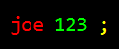
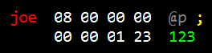
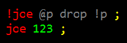
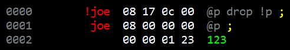
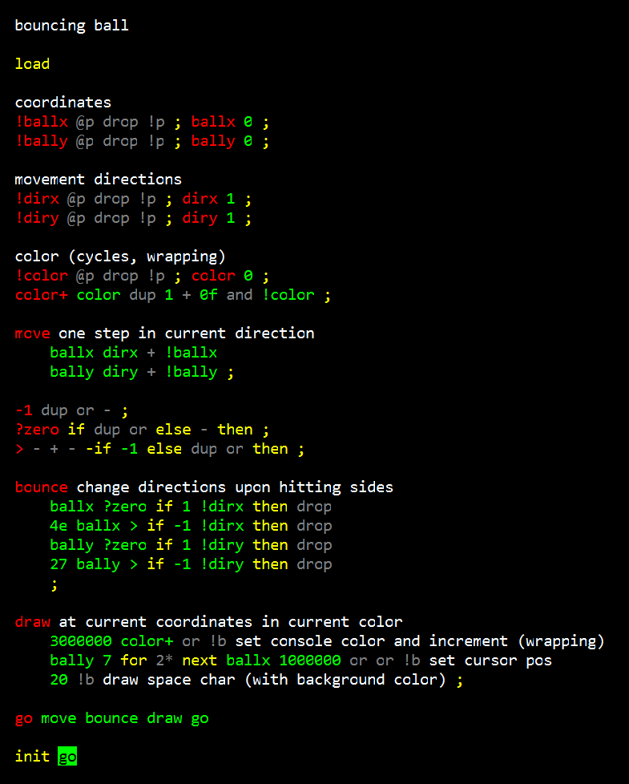
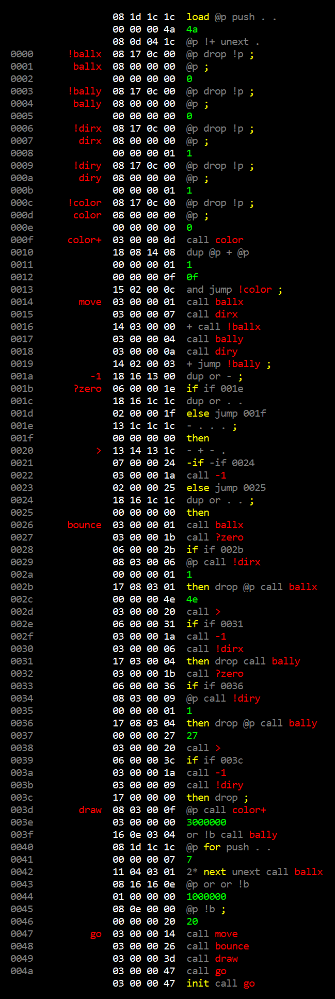

# Simple Variables

This is the fifth in a series:

* [Chuck Moore's Creations](chuck_moores_creations.md)
* [Programming the F18](programming_the_f18.md)
* [Beautiful Simplicity of colorForth](beautiful_simplicity.md)
* [Multiply-step Instruction](multiply_step.md)
* Simple Variables

Variables on the F18 are not like regular Forth variables. Usually a variable is a word returning the address of its value used along with fetch (`@`) and store (`!`) words. On the F18 the idiomatic approach is to have individual _variable-specific_ fetch and store words.

[Greg Bailey explains it nicely here](https://www.youtube.com/watch?v=ueoHb8Ic0kc).

## Constants

Let's start with constants. To make a constant in colorForth we define a simple word that pushes a literal value and returns.

This is a good idea if we use the value in multiple places. It compiles to the following; taking two memory cells:

Retrieving the value is a `call`/`jump` to `joe`. If instead we inlined the literal `123` it would take one cell (four slots) plus one more slot for the `@p` instruction. Besides consolidating the value to a single place in your source, you are saving space by avoiding multiple inline literals.

## Variables

The tricky part comes when you want to set the value. It's been many years (decades!) since programmers regularly dealt with self-modifying code, but here we go. We define `!joe` directly preceding the constant in such a way as to reach in and manipulate the value in place.

It's easier to understand when looking at the assembly:

Remember that the `P` register points at the next word from which instructions will be fetched. Each fetch populates the `I` register from which instructions are then executed. So while `!joe` (at address `0000`) is being executed, the `P` register already points at address `0001`. The `@p` drop fetches and discards the contents of this address, essentially incrementing `P` (to `0002`). Then the `!p` stores a value from the stack at that address and we return; having stomped on the literal value in place!

## Demo

Let's put the trick to use with a fun little demo. We'll have a "ball" with an x/y position (stored in a pair of variables) and a direction (another pair) as well as a cycling color. We'll paint a little block to the console to represent the ball (note that the `B` register initially points to the console device and there's a protocol for setting the cursor position and color). We'll check for the ball hitting the boundaries of the console and reverse the direction; bouncing off the "walls". The result is kind of interesting to watch!

Here's the source:

You may notice some little tricks in there, like `dup or` to produce a zero on the stack or `- + -` to perform subtraction. Some of these are listed in [this little gem](http://www.colorforth.com/inst.htm) by Chuck Moore himself. We'll get into these and others in a future post.

Here's the assembly if you're curious:

