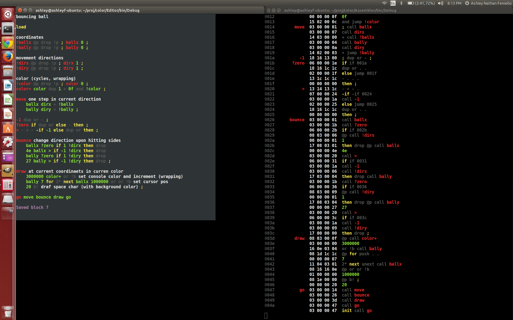

Color
=====

Having fun playing around with [colorForth](http://www.colorforth.com/cf.htm) and [GreenArrays](http://www.greenarraychips.com/) architecture. See the [demo](http://www.youtube.com/watch?v=LJoRyxRcj4A&feature=share&list=UUaahWOc75YojOsBjD0RxLlw) and [~~blog series~~](http://blogs.msdn.com/b/ashleyf/archive/tags/color/) - Blog series moved here to Github:

* [Chuck Moore's Creations](Docs/chuck_moores_creations.md)
* [Programming the F18](Docs/programming_the_f18.md)
* [Beautiful Simplicity of colorForth](Docs/beautiful_simplicity.md)
* [Multiply-step Instruction](Docs/multiply_step.md)
* [Simple Variables](Docs/simple_variables.md)

The assembler watches for changes to the block files saved by the editor. I leave an instance of this running in one terminal window (right) while working in the editor in another (left). Later I run the machine in a third window.

## Setup

Everything is written in F# and uses solution (`.sln`) and project (`.fsproj`) files compatible with Visual Studio, Xamarin or plain xbuild. I personally have been using plain Vim (with the [excellent F# bindings](https://github.com/fsharp/fsharpbinding)). Here's setup steps for Ubuntu:

**Install F#**

    sudo apt-get update
    sudo apt-get install mono-complete
    sudo apt-get install fsharp

**Pull down the project**

    git clone http://github.com/AshleyF/Color

**Build**

    xbuild Color.sln

Each project produces an executable (`Assembler.exe`, `Editor.exe`, `Machine.exe`) within `bin/`
